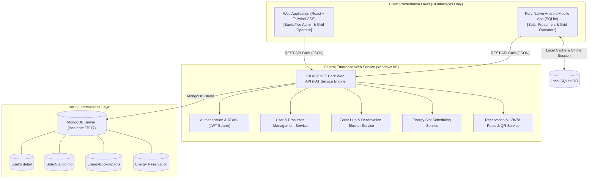
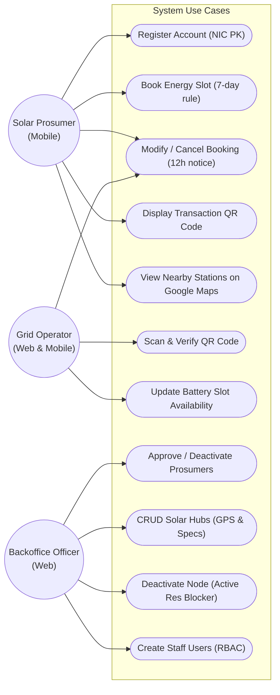
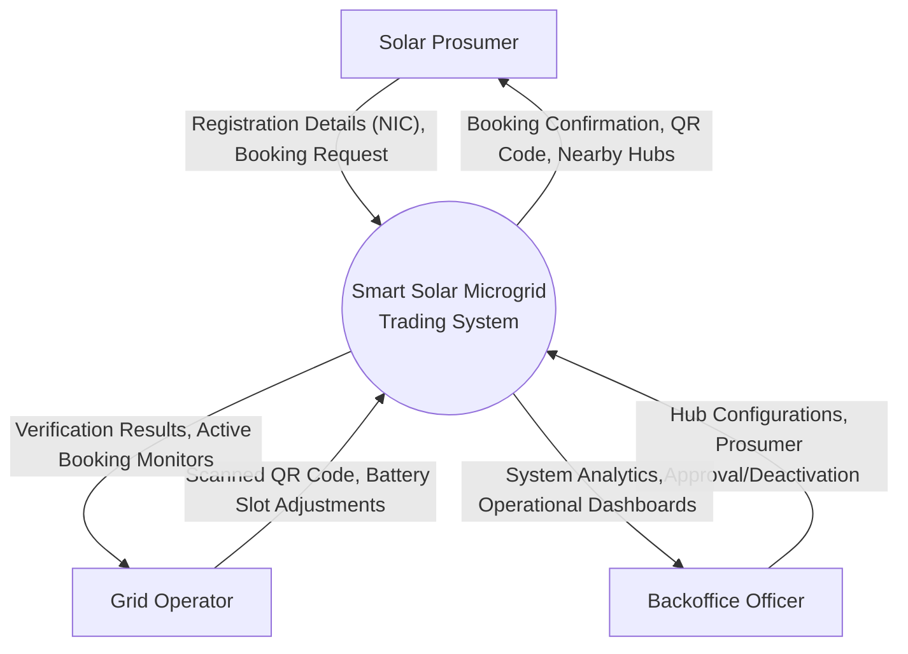
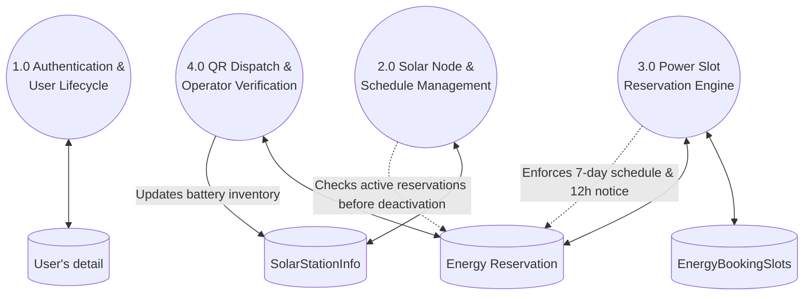

# Solvance — System Architecture & Data Flow Diagrams
**Smart Solar Microgrid Trading System — Decentralized Clean Energy Network**

  

---

## 1. High-Level System Architecture Diagram (FAT Service Pattern)

---

## 2. Use Case Diagram

---

## 3. Data Flow Diagram (DFD)

### Level 0 Context Diagram

### Level 1 Detailed Process DFD

