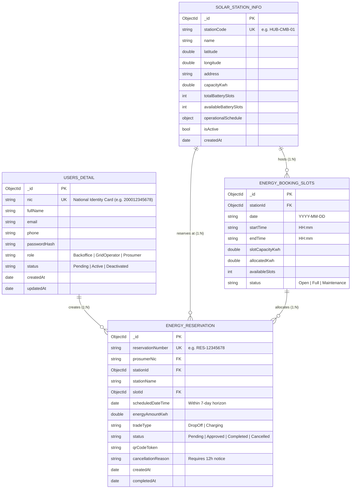

# Solvance — MongoDB Database Design Document
**Database**: `SolarMicrogridDb`  
**Host**: MongoDB Atlas Cloud Cluster (`cluster0.4f8gcpw.mongodb.net`)  
**System**: Smart Solar Microgrid Trading System (FAT Service Architecture)

  

---

## 1. Overview of Collections

The database uses MongoDB NoSQL document storage designed with consistent relational references across four primary collections:

1. **`User's detail`**: User profiles, credentials, role-based authorization, and prosumer activation states.
2. **`SolarStationInfo`**: Distributed microgrid solar hubs, GPS coordinates, generating capacity, battery banks, and operational schedules.
3. **`EnergyBookingSlots`**: Available discrete time/energy slots for each station.
4. **`Energy Reservation`**: Prosumer booking transactions, scheduled times, trade types, approval status, and signed QR tokens.

### Entity-Relationship (ER) Diagram

---

## 2. Collection Schemas & Data Dictionaries

### Collection 1: `User's detail`
* **Purpose**: Primary identity store. National Identity Card (NIC) serves as the primary key.
* **Indexes**: `{ "nic": 1 }` (Unique).

| Field Name | BSON Type | Constraints / Rules | Description |
|---|---|---|---|
| `_id` | ObjectId | Primary Key | Internal MongoDB document identifier. |
| `nic` | String | Unique, Indexed, Required | National Identity Card number (e.g. `200012345678`). |
| `fullName` | String | Required | User's full name. |
| `email` | String | Required | Contact email address. |
| `phone` | String | Required | Contact mobile phone number. |
| `passwordHash` | String | Required | Secure BCrypt salted password hash. |
| `role` | String | `"Backoffice"`, `"GridOperator"`, `"Prosumer"` | System access level. |
| `status` | String | `"Pending"`, `"Active"`, `"Deactivated"` | Prosumer registration starts at `"Pending"`. |
| `createdAt` | ISODate | Auto-generated | Account registration timestamp. |
| `updatedAt` | ISODate | Auto-generated | Last profile modification timestamp. |

---

### Collection 2: `SolarStationInfo`
* **Purpose**: Stores technical specifications and location of each physical solar microgrid hub.

| Field Name | BSON Type | Description |
|---|---|---|
| `_id` | ObjectId | Station unique identifier. |
| `stationCode` | String | Hub identifier (e.g. `HUB-CMB-01`). |
| `name` | String | Station display name. |
| `latitude` | Double | GPS Latitude coordinate for Google Maps API. |
| `longitude` | Double | GPS Longitude coordinate for Google Maps API. |
| `address` | String | Physical street address. |
| `capacityKwh` | Double | Peak solar generation capacity in kW/h. |
| `totalBatterySlots` | Integer | Total physical battery storage bays installed. |
| `availableBatterySlots` | Integer | Currently unoccupied battery slots. |
| `operationalSchedule` | Object | Sub-document containing `openTime`, `closeTime`, and `daysOpen`. |
| `isActive` | Boolean | Operational flag. **Deactivation blocked if active reservations exist**. |
| `createdAt` | ISODate | Hub commission timestamp. |

---

### Collection 3: `EnergyBookingSlots`
* **Purpose**: Time slots allocated by grid operators for energy drop-off and charging.

| Field Name | BSON Type | Description |
|---|---|---|
| `_id` | ObjectId | Slot unique identifier. |
| `stationId` | ObjectId | Reference to `SolarStationInfo._id`. |
| `date` | String | Date in `YYYY-MM-DD` format. |
| `startTime` | String | Slot start time in `HH:mm` format. |
| `endTime` | String | Slot end time in `HH:mm` format. |
| `slotCapacityKwh` | Double | Total energy volume available in this window. |
| `allocatedKwh` | Double | Amount currently reserved by prosumers. |
| `availableSlots` | Integer | Remaining available booking positions. |
| `status` | String | `"Open"`, `"Full"`, `"Maintenance"`. |

---

### Collection 4: `Energy Reservation`
* **Purpose**: Power trading transaction records created by solar prosumers.

| Field Name | BSON Type | Description |
|---|---|---|
| `_id` | ObjectId | Transaction unique identifier. |
| `reservationNumber` | String | Unique tracking reference (e.g. `RES-12345678`). |
| `prosumerNic` | String | Reference to `User's detail.nic`. |
| `stationId` | ObjectId | Reference to `SolarStationInfo._id`. |
| `stationName` | String | Denormalized station name for quick query display. |
| `slotId` | ObjectId | Reference to `EnergyBookingSlots._id`. |
| `scheduledDateTime` | ISODate | Scheduled appointment time (enforced within 7 days). |
| `energyAmountKwh` | Double | Requested energy trade volume in kW/h. |
| `tradeType` | String | `"DropOff"` (feed into grid) or `"Charging"` (draw from grid). |
| `status` | String | `"Pending"`, `"Approved"`, `"Completed"`, `"Cancelled"`. |
| `qrCodeToken` | String | Cryptographically signed token string rendered in QR code. |
| `cancellationReason` | String | Logged reason if cancelled (enforced 12h rule). |
| `createdAt` | ISODate | Transaction creation timestamp. |
| `completedAt` | ISODate | Timestamp when operator scans QR code and finalizes job. |
