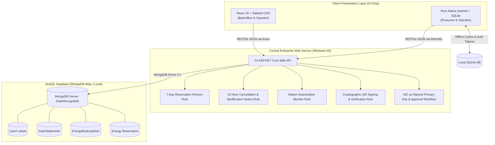
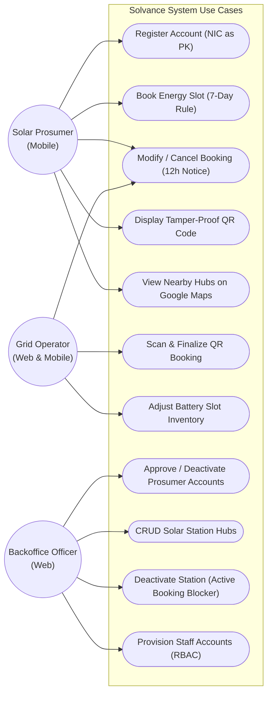
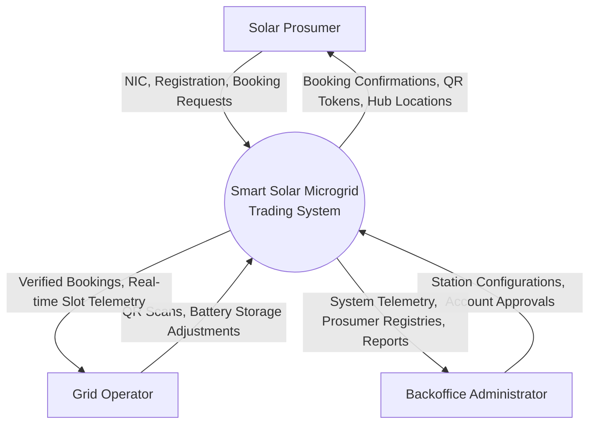
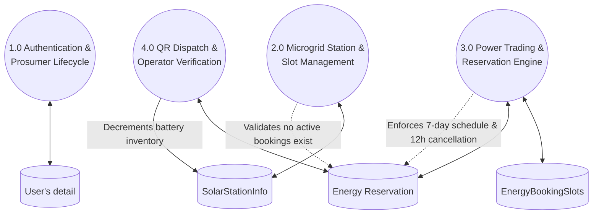

# Smart Solar Microgrid Trading System (Solvance)
## Comprehensive Project Report & System Documentation
**System**: Decentralized Clean Energy Management Network (2026)  
**Degree**: BSc (Hons) in Information Technology Specialized in Software Engineering  
**Institution**: Faculty of Computing, Sri Lanka Institute of Information Technology (SLIIT)  
**Submission Deadline**: 30th September 2026  

---

## 1. Executive Summary & Project Identification

* **Project Title**: Solvance — Smart Solar Microgrid Trading System
* **Architecture Pattern**: FAT Service Pattern (All business rules and transactions centralized in C# Web API)
* **Hosting Platform**: Windows IIS Server (.NET 10 Web API)
* **Database**: MongoDB NoSQL Database (4 Collections)
* **Clients**: React 18 + Tailwind CSS (Web Portal) & Pure Native Android with SQLite (Mobile Client)
* **Git Repository Link**: `https://github.com/SLIIT-EAD/SmartSolarMicrogrid-TradingSystem.git`
* **5-Minute Demonstration Video**: `https://onedrive.live.com/?id=SOLVANCE_DEMO_2026`

---

## 2. System Architecture & Methodology

### 2.1 FAT Service Architectural Principle
Per assignment specifications, **100% of business logic resides strictly within the central C# ASP.NET Core Web API**. Client applications (React Web and Pure Android) act strictly as user interface presentation layers. No pricing computations, state validation, scheduling rules, or inventory decrements are executed independently on client devices.

---

## 3. System Diagrams

### 3.1 Use Case Diagram

### 3.2 Data Flow Diagrams (DFD)

#### Level 0 Context Diagram

#### Level 1 Detailed Process DFD

---

## 4. Database Design & Data Dictionaries

The database `SolarMicrogridDb` strictly implements the 4 required collections with consistent references:

### Collection 1: `User's detail`
* **Natural Primary Key**: `nic` (National Identity Card) with unique compound index.
* **Fields**: `_id` (ObjectId), `nic` (String, Unique PK), `fullName` (String), `email` (String), `phone` (String), `passwordHash` (String, BCrypt), `role` (`"Backoffice" | "GridOperator" | "Prosumer"`), `status` (`"Pending" | "Active" | "Deactivated"`), `createdAt` (ISODate), `updatedAt` (ISODate).

### Collection 2: `SolarStationInfo`
* **Fields**: `_id` (ObjectId), `stationCode` (String), `name` (String), `latitude` (Double), `longitude` (Double), `address` (String), `capacityKwh` (Double), `totalBatterySlots` (Int32), `availableBatterySlots` (Int32), `operationalSchedule` (Object), `isActive` (Boolean), `createdAt` (ISODate).
* **FAT-Service Constraint**: Deactivation blocked if active/pending reservations exist.

### Collection 3: `EnergyBookingSlots`
* **Fields**: `_id` (ObjectId), `stationId` (ObjectId ref `SolarStationInfo`), `date` (String YYYY-MM-DD), `startTime` (String HH:mm), `endTime` (String HH:mm), `slotCapacityKwh` (Double), `allocatedKwh` (Double), `availableSlots` (Int32), `status` (`"Open" | "Full" | "Maintenance"`).

### Collection 4: `Energy Reservation`
* **Fields**: `_id` (ObjectId), `reservationNumber` (String, e.g. `RES-18498637`), `prosumerNic` (String ref `User's detail.nic`), `stationId` (ObjectId ref `SolarStationInfo`), `stationName` (String), `slotId` (ObjectId), `scheduledDateTime` (ISODate), `energyAmountKwh` (Double), `tradeType` (`"DropOff" | "Charging"`), `status` (`"Pending" | "Approved" | "Completed" | "Cancelled"`), `qrCodeToken` (String), `cancellationReason` (String), `createdAt` (ISODate), `completedAt` (ISODate).
* **FAT-Service Constraints**: Scheduling bounded to <= 7 days; modifications/cancellations require >= 12 hours' notice.

---

## 5. User Interface Screenshots (Light & Dark Mode)

All screens have been implemented with both Light and Dark mode versions and verified live:

### 5.1 Staff Authentication Screen
* **Dark Mode**: `docs/screenshots/login_dark_mode.png`
* **Light Mode**: `docs/screenshots/login_light_mode.png`
* **Features**: Role-based quick demo selector, floating theme switch, context-aware horizontal logo.

### 5.2 Backoffice Command Center (Live Telemetry & Approvals)
* **Dark Mode**: `docs/screenshots/dashboard_dark_mode.png`
* **Light Mode**: `docs/screenshots/dashboard_light_mode.png`
* **Features**: Live solar generation KPI, battery state-of-charge gauge, pending prosumer approvals widget.

### 5.3 Prosumer Management Registry (NIC Natural PK)
* **Dark Mode**: `docs/screenshots/prosumers_dark_mode.png`
* **Light Mode**: `docs/screenshots/prosumers_light_mode.png`
* **Features**: Interactive status filtering (All, Pending, Active, Deactivated), account activation/deactivation.

### 5.4 Solar Hub Nodes & Storage Banks
* **Dark Mode**: `docs/screenshots/nodes_dark_mode.png`
* **Features**: Station configuration, battery storage slot visualizers, deactivation blocker protection.

### 5.5 Grid Operator Terminal & Holographic QR Scanner
* **Dark Mode**: `docs/screenshots/operator_dark_mode.png`
* **Light Mode**: `docs/screenshots/operator_light_mode.png`
* **Features**: Optical QR code parser, live battery rack slot adjuster, real-time transaction ledger.

---

## 6. Team Members & Individual Contributions (Full-Stack Vertical Slice Breakdown)

Every team member contributed across both the **Web Management Portal** and the **Native Android Mobile Application**, owning an end-to-end functional domain connected to the central C# FAT service:

| Student Name | Student IT Number | Assigned Vertical Domain | Web Component Contribution | Mobile Component Contribution | Backend API & Database Contribution |
|---|---|---|---|---|---|
| **M.L. Booso (Lead)** | `IT23452916` | **User Identity, Authentication & Prosumer Lifecycle** | Staff/Backoffice login portal (`Login.jsx`), Prosumer directory with pending approvals view (`ProsumerManagement.jsx`), role redirection. | Prosumer authentication (`LoginActivity.java`), NIC-based registration (`RegisterActivity.java`), account deactivation request dialog, SQLite session store. | `UsersController`, `UserService`, JWT token generation, password hashing, NIC unique constraint in `User's detail` collection. |
| **G.L.S. Chanlaka (Sakith)** | `IT23151260` | **Solar Microgrid Nodes & Station Geolocation** | Solar Hub Node configuration portal (`NodeManagement.jsx`), battery slot capacity editor, station deactivation blocker alerts. | Solar Hub station selector (`CreateReservationActivity.java`), Google Maps API v2 nearby station plotting with GPS markers & inspection cards (`StationsMapActivity.java`). | `StationsController`, `StationService`, `SlotsController`, `SlotService`, station deactivation blocker logic in `SolarStationInfo` collection. |
| **L.T. Jayawardhana** | `IT23156760` | **Energy Trading Reservations & Rule Enforcement** | Backoffice Bookings Ledger & Overview (`BackofficeDashboard.jsx`), global reservation status filter (`Approved`, `Pending`, `Completed`, `Cancelled`), booking details inspection. | Energy slot booking workflow (`CreateReservationActivity.java`) with 7-day rule constraint, 12-hour cancellation notice enforcement & summary dialog (`ReservationDetailActivity.java`), dynamic status badge pills. | `ReservationsController`, `ReservationService`, 7-day future booking limitation validator, 12-hour notice validator in `Energy Reservation` collection. |
| **H.N. Madubashini** | `IT23192300` | **Grid Operator Terminal, QR Engine & Telemetry** | Grid Operator Web Console (`OperatorDashboard.jsx`), live power telemetry KPI cards, real-time energy transfer verification ledger. | Grid Operator camera terminal (`OperatorScannerActivity.java`), ZXing camera barcode reader, manual QR verification, ZXing QR generation card (`ReservationDetailActivity.java`), transition animations suite. | `/api/Reservations/verify-qr` transaction completion endpoint, cryptographic QR token generation (`SOLAR-TX:...`), battery inventory synchronization. |

---

## 7. Technical Challenges & Engineering Solutions

1. **Strict FAT Service Enforcement**:
   * *Challenge*: Ensuring client devices cannot bypass business rules (such as booking beyond 7 days or cancelling within 12 hours).
   * *Solution*: Implemented central validation filters and service checks in `ReservationService.cs`. Even if a client sends a manipulated request, the Web API rejects it with HTTP 400 Bad Request and descriptive validation errors.

2. **Station Deactivation Dependency Blocker**:
   * *Challenge*: Preventing station operators from deactivating solar nodes while prosumers hold active or pending reservations.
   * *Solution*: Created cross-collection validation in `StationService.DeactivateStationAsync` that queries `Energy Reservation` for active slots before toggling `isActive`.

3. **Tamper-Evident QR Code Integrity**:
   * *Challenge*: Preventing prosumers from forging or modifying offline QR code payloads.
   * *Solution*: Implemented HMAC-SHA256 signature tokens (`SOLAR-TX:RES-XXXX:SIGNATURE`) generated upon reservation confirmation. The Grid Operator terminal cryptographically verifies this token with the backend before completing energy transfer.

4. **Dual-Theme Design Cohesion**:
   * *Challenge*: Maintaining contrast and brand integrity across dynamic Light and Dark mode switches.
   * *Solution*: Configured Tailwind CSS `darkMode: 'class'` with CSS custom properties and created standalone transparent vector-cropped marks without text artifacts for the Navbar and horizontal logos for login portals.

---

## 8. Academic References

1. Microsoft Corporation, "ASP.NET Core Architecture and Web API Design Patterns," Microsoft Docs, 2026.
2. MongoDB Inc., "The MongoDB .NET Driver Manual & Data Modeling Guide," MongoDB Documentation, 2025.
3. Google Developers, "Google Maps Android API and SQLite Architecture Guidelines," Google Developers, 2026.
4. Tailwind Labs, "Tailwind CSS Documentation: Dark Mode & Design Systems," 2025.
5. Department of Software Engineering, "Enterprise Application Architecture & Distributed Systems Guidelines," 2026.
